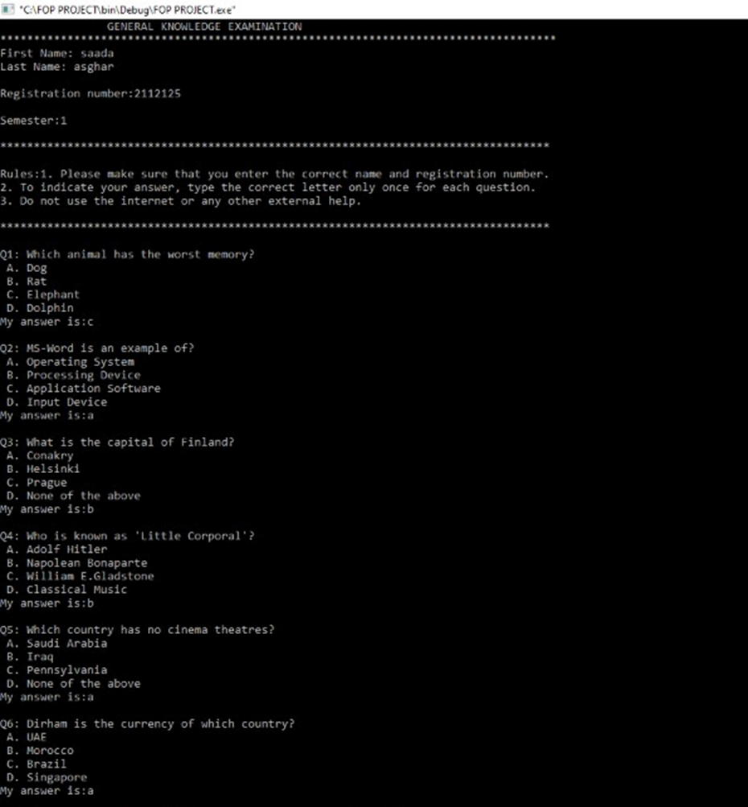
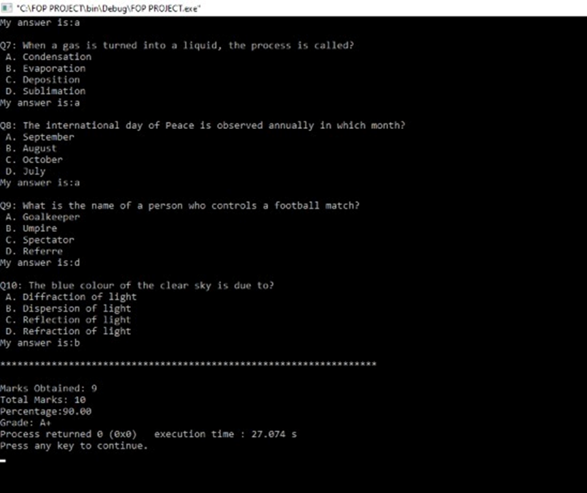

# Exam-Managment-System
 A project developed in C programming language, this program streamlines the creation and scoring of quizzes and simplifys examination procedures. It provides a user-friendly interface for both, quiz generation and question management, enabling effective assessment of participants.

 This Examination management System program is very simple to use. All the student has to do is press the correct alphabet keys (A,B,C,D) for each question. You do not have to do any additional work to calculate the marks or grade as the program will do it for them.

 The program holds 10 questions and on selecting the correct answer, 1 mark is added to the total.

 The marks obtained are shown at the end of the exam after all the questions are attempted.

 There are total 25 questions but every user gets a randomly assigned group of 10 questions each time.

 -This is a very simple basic C program. Uses the concepts of FOP. 
 -Comments are added for ease of understanding each significant chunk of code. 

 Output:
 
 

